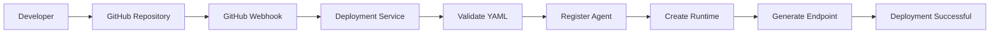
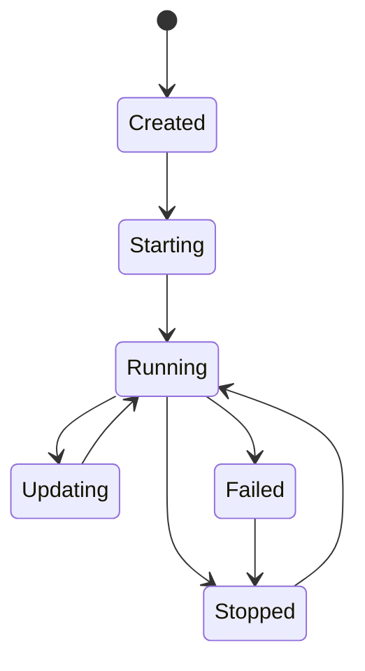

# 04 - Deployment Engine

> **Purpose:**  
> The Deployment Engine is responsible for transforming an AI agent definition into a running service. It manages validation, deployment, runtime creation, versioning, lifecycle management, and endpoint generation.

---

# Overview

The Deployment Engine is the core component of **R Agent Cloud**.

Instead of manually deploying AI agents, developers only need to push their code or configuration to GitHub. The platform automatically validates, deploys, and exposes the agent through a managed API endpoint.

The deployment engine is designed to abstract infrastructure complexity while providing a consistent deployment workflow.

---

# Responsibilities

The Deployment Engine is responsible for:

- Reading agent configurations
- Validating YAML specifications
- GitHub Webhook Integration
- Managing deployment pipelines
- Registering new agents
- Creating runtime instances
- Managing deployment versions
- Rolling back failed deployments
- Generating public endpoints
- Sending deployment events
- Tracking deployment status

---

# Deployment Workflow



---

# Deployment Lifecycle

Every deployment passes through the following stages.

| Stage | Description |
|---------|-------------|
| Pending | Deployment request received |
| Validating | YAML and project validation |
| Building | Preparing runtime |
| Deploying | Runtime initialization |
| Running | Agent is live |
| Updating | New version deployment |
| Failed | Deployment failed |
| Stopped | Runtime stopped |

---

# Deployment Trigger Methods

## 1. GitHub Push

A push to the configured repository automatically triggers deployment.

Example:

```text
Developer
      │
git push
      │
GitHub Webhook
      │
Deployment Engine
```

---

## 2. Manual Deployment

Users can deploy directly from the dashboard.

```text
Dashboard

↓

Deploy Button

↓

Deployment Engine
```

---

## 3. API Deployment

External applications can deploy agents using REST APIs.

Example

```http
POST /api/v1/deployments
```

---

# YAML Configuration

Every agent must provide a deployment configuration.

Example:

```yaml
agent:
  name: support-agent
  version: 1.0.0

runtime:
  framework: langgraph
  language: python

model:
  provider: openai
  model: gpt-5

tools:
  - search
  - database

deployment:
  replicas: 1
  cpu: 1
  memory: 1Gi

observability:
  enabled: true
```

---

# YAML Validation

Before deployment, the Deployment Engine validates:

- Required fields
- Agent name
- Runtime
- Model configuration
- Tool configuration
- Resource limits
- Version information

If validation fails, deployment stops immediately.

---

# Agent Registry

Every deployed agent is registered inside the Agent Registry.

Stored metadata includes:

- Agent ID
- Agent Name
- Version
- Repository URL
- Runtime
- Owner
- Deployment Status
- Endpoint
- Creation Date
- Update Date

The registry acts as the source of truth for all deployed agents.

---

# Runtime Creation

Once validation succeeds, the Runtime Manager creates a runtime instance.

Responsibilities:

- Initialize runtime
- Load configuration
- Register tools
- Connect memory
- Initialize model provider
- Start runtime

---

# Endpoint Generation

Every deployment receives a managed endpoint.

Example:

```text
https://api.ragent.cloud/agents/support-agent
```

Future versions may support:

```text
https://support.example.com
```

through custom domains.

---

# Deployment Versioning

Every deployment creates a new version.

Example:

| Version | Status |
|----------|--------|
| v1.0.0 | Active |
| v1.1.0 | Active |
| v1.2.0 | Failed |
| v1.1.0 | Rollback |

Version history allows restoring previous deployments.

---

# Rollback Strategy

If deployment fails:

```text
Deploy New Version

↓

Health Check

↓

Success?
```

If **No**

```text
Rollback Previous Version
```

The previous runtime remains available until the new deployment becomes healthy.

---

# Runtime Lifecycle



---

# Deployment Events

Every deployment generates events.

Examples:

```text
Deployment Started

Deployment Validated

Runtime Created

Endpoint Generated

Deployment Completed

Deployment Failed

Deployment Rolled Back
```

These events are forwarded to the Observability Service.

---

# Integration with Observability

The Deployment Engine emits telemetry for:

- Deployment duration
- Validation time
- Runtime startup time
- Deployment failures
- Rollbacks
- Active deployments

These metrics are collected using OpenTelemetry and displayed in the monitoring dashboard.

---

# Error Handling

Possible deployment failures include:

- Invalid YAML
- Missing model configuration
- Unsupported runtime
- Runtime initialization failure
- Agent registration failure
- GitHub webhook verification failure
- Database connection failure

Each failure generates:

- Error logs
- Trace information
- Deployment report

---

# Public APIs

## Create Deployment

```http
POST /api/v1/deployments
```

---

## Get Deployment Status

```http
GET /api/v1/deployments/{deploymentId}
```

---

## List Deployments

```http
GET /api/v1/deployments
```

---

## Rollback Deployment

```http
POST /api/v1/deployments/{deploymentId}/rollback
```

---

## Stop Deployment

```http
POST /api/v1/deployments/{deploymentId}/stop
```

---

# Future Enhancements

- Blue-Green Deployments
- Canary Deployments
- Automatic Scaling
- Zero-Downtime Updates
- Multi-Region Deployments
- Custom Domains
- Kubernetes Integration
- CI/CD Pipelines
- Deployment Templates
- Multi-Cloud Support

---

# Summary

The Deployment Engine is responsible for the complete lifecycle of AI agent deployment. It validates agent configurations, creates runtime environments, manages deployment versions, generates public endpoints, integrates with observability services, and ensures reliable deployment through rollback and lifecycle management.
