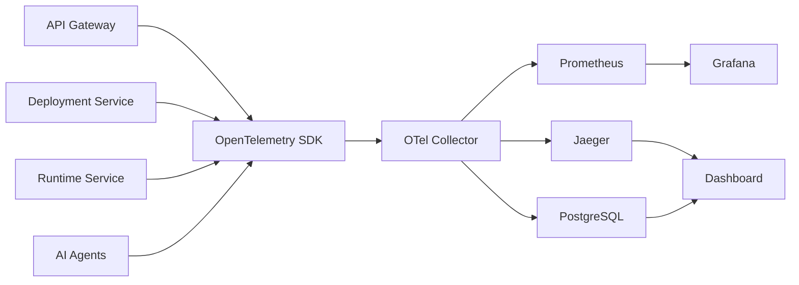
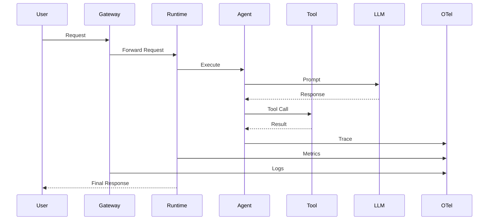

# 05 - Observability

> **Purpose:**  
> The Observability Service provides complete visibility into deployed AI agents by collecting logs, metrics, traces, events, and runtime analytics. It helps developers monitor agent health, debug failures, analyze performance, and optimize costs.

---

# Overview

AI agents are long-running, distributed applications that interact with multiple services such as LLM providers, databases, APIs, and external tools.

Unlike traditional applications, debugging AI agents requires visibility into:

- Prompt execution
- Tool calls
- Model latency
- Token usage
- Memory retrieval
- Multi-agent communication
- Runtime performance

The Observability Service centralizes all this information into a single dashboard.

---

# Goals

- Monitor every deployed AI agent
- Collect distributed traces
- Capture runtime logs
- Monitor infrastructure metrics
- Track token consumption
- Analyze API costs
- Debug multi-agent workflows
- Detect failures and bottlenecks
- Provide real-time dashboards

---

# Architecture



---

# Components

## OpenTelemetry

OpenTelemetry is responsible for instrumenting every service in the platform.

It collects:

- Traces
- Metrics
- Logs

Every microservice sends telemetry data through the OpenTelemetry SDK.

---

## OpenTelemetry Collector

The collector receives telemetry data from every service and exports it to different backends.

Responsibilities:

- Data aggregation
- Data processing
- Export pipelines
- Sampling
- Filtering

---

## Prometheus

Prometheus stores time-series metrics.

Examples:

- CPU Usage
- Memory Usage
- Request Rate
- Error Rate
- Response Time

---

## Jaeger

Jaeger visualizes distributed traces.

It allows developers to inspect every step of an agent execution.

Example:

```text
Gateway
 ↓
Runtime
 ↓
GPT Request
 ↓
Tool Call
 ↓
Database
 ↓
Response
```

---

## Grafana

Grafana provides dashboards for:

- Infrastructure
- Runtime
- AI Agents
- Deployment
- Cost Analytics
- Performance

---

# Collected Metrics

## Platform Metrics

- Total Requests
- Active Agents
- Running Deployments
- API Throughput
- Success Rate
- Failure Rate

---

## Runtime Metrics

- Runtime Startup Time
- Runtime Health
- Restart Count
- Active Sessions
- Memory Usage
- CPU Usage

---

## AI Metrics

- Prompt Tokens
- Completion Tokens
- Total Tokens
- Model Response Time
- Tool Execution Time
- Memory Retrieval Time

---

## Deployment Metrics

- Deployment Duration
- Deployment Failures
- Rollback Count
- Runtime Initialization Time

---

# Distributed Tracing

Every request receives a unique Trace ID.

Example:

```text
Trace ID

↓

API Gateway

↓

Runtime Service

↓

Planner Agent

↓

Research Agent

↓

Tool Call

↓

OpenAI API

↓

Database

↓

Final Response
```

Developers can inspect each span independently.

---

# Logs

Each service generates structured logs.

Example

```json
{
  "timestamp": "...",
  "service": "runtime-service",
  "agent": "research-agent",
  "level": "INFO",
  "traceId": "...",
  "message": "Tool execution completed"
}
```

---

# Events

The platform records important lifecycle events.

Examples:

- Deployment Started
- Deployment Completed
- Runtime Started
- Runtime Stopped
- Agent Invoked
- Tool Executed
- Memory Retrieved
- LLM Response Received
- Agent Completed

---

# Agent Execution Timeline



---

# Dashboard Modules

## Platform Dashboard

Displays:

- Total Deployments
- Active Agents
- Runtime Status
- API Requests
- Overall Health

---

## Agent Dashboard

Displays:

- Running Status
- Current Version
- Endpoint
- Runtime Health
- Recent Requests

---

## Trace Explorer

Developers can inspect:

- Complete request flow
- Individual spans
- Latency per operation
- Errors

---

## Logs Viewer

Features:

- Search logs
- Filter by service
- Filter by agent
- Filter by deployment
- Filter by trace ID

---

## Metrics Dashboard

Visualizes:

- CPU
- Memory
- Latency
- Throughput
- Requests per Second
- Error Rate

---

## Cost Dashboard

Tracks:

- Prompt Tokens
- Completion Tokens
- Total Tokens
- Cost per Request
- Cost per Agent
- Cost per Project
- Daily & Monthly Usage

---

# Alerting

The system can generate alerts for:

- Deployment failures
- High latency
- Runtime crashes
- Excessive token usage
- High API cost
- Unhealthy services

Future integrations:

- Email
- Slack
- Discord
- Microsoft Teams

---

# OpenTelemetry Integration

The following services are instrumented:

- API Gateway
- Deployment Service
- Runtime Service
- AI Runtime
- PostgreSQL
- gRPC Communication
- WebSocket Server

Each service exports:

- Traces
- Metrics
- Logs

---

# Future Enhancements

- AI-powered anomaly detection
- Custom dashboards
- Distributed log search
- Predictive cost analysis
- Real-time notifications
- SLO & SLA monitoring
- Multi-tenant observability
- Usage analytics
- Performance benchmarking

---

# Summary

The Observability Service provides complete visibility into the R Agent Cloud platform. By combining OpenTelemetry, Prometheus, Jaeger, and Grafana, it enables developers to monitor deployments, inspect distributed traces, analyze runtime performance, debug AI workflows, and optimize operational costs from a unified dashboard.