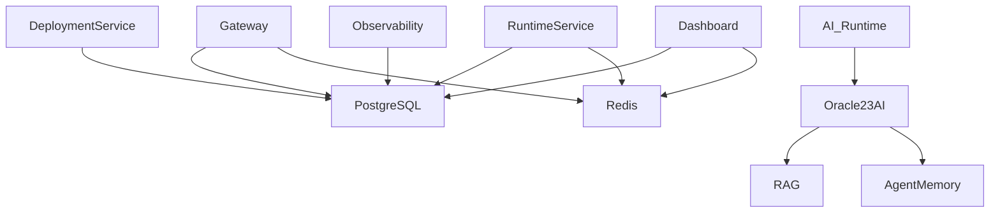

# 06 - Database Design

## Purpose

The Database Layer is responsible for storing and managing all persistent and temporary data within **R Agent Cloud**. It provides a scalable and reliable storage architecture for platform metadata, AI agent configurations, deployments, runtime information, observability metadata, vector embeddings, caching, and session management.

The platform follows a **polyglot persistence architecture**, where each database is selected based on its strengths and workload.

---

# Database Architecture

R Agent Cloud uses three different storage technologies.

| Database | Purpose |
|----------|---------|
| PostgreSQL | Primary transactional database |
| Oracle Database 23ai | AI Vector Database and Semantic Search |
| Redis | In-memory cache, sessions, runtime state, and queues |

Each database serves a dedicated responsibility to maximize performance and maintainability.

---

# Database Responsibilities

## PostgreSQL

PostgreSQL is the primary database of the platform and acts as the source of truth.

It stores:

- Users
- Organizations
- Projects
- GitHub Repositories
- AI Agents
- Agent Configurations
- Deployments
- Runtime Metadata
- Runtime Instances
- API Keys
- Audit Logs
- Execution History
- Trace Metadata
- Deployment Versions

---

## Oracle Database 23ai

Oracle Database 23ai provides native AI and vector capabilities.

It is responsible for:

- Embedding Storage
- Vector Indexes
- Semantic Search
- Retrieval-Augmented Generation (RAG)
- Long-Term Agent Memory
- Knowledge Base Storage
- Enterprise Document Search
- Similarity Search
- Context Retrieval

Oracle Database 23ai allows AI agents to retrieve relevant context using vector similarity search before interacting with an LLM.

---

## Redis

Redis is used as a high-performance in-memory data store.

It is responsible for:

- Session Storage
- API Rate Limiting
- Runtime Cache
- Agent State Cache
- Frequently Accessed Configurations
- Deployment Queue
- WebSocket State
- Temporary Tokens
- Distributed Locks

Redis improves response times by reducing repeated database queries.

---

# High-Level Database Architecture

---

# Why Multiple Databases?

Instead of forcing every workload into a single database, R Agent Cloud uses specialized storage systems.

| Workload | Database |
|----------|----------|
| Platform Metadata | PostgreSQL |
| Transactions | PostgreSQL |
| Agent Configuration | PostgreSQL |
| Deployment History | PostgreSQL |
| Runtime Metadata | PostgreSQL |
| Embeddings | Oracle Database 23ai |
| Semantic Search | Oracle Database 23ai |
| Long-Term Memory | Oracle Database 23ai |
| RAG Retrieval | Oracle Database 23ai |
| Cache | Redis |
| Sessions | Redis |
| WebSocket State | Redis |
| Rate Limiting | Redis |

This architecture provides better scalability and aligns with modern cloud-native platform design.
