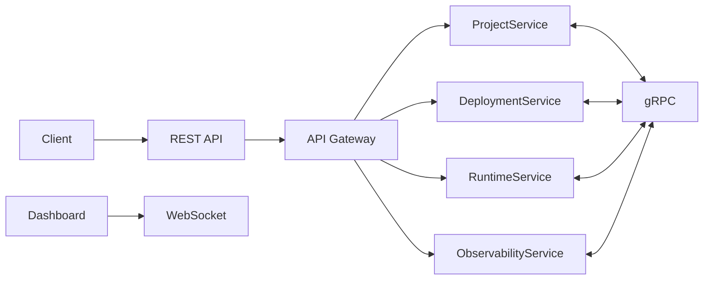

# 07 - API Design

## Purpose

The API Layer serves as the communication backbone of **R Agent Cloud**. It exposes REST APIs for external clients, gRPC APIs for internal microservices, and WebSocket connections for real-time monitoring.

The API layer is responsible for authentication, routing, deployment management, runtime communication, observability, and project management.

---

# API Architecture



---

# Communication Strategy

| Communication | Protocol |
|--------------|----------|
| Client → Platform | HTTP REST |
| Dashboard → Platform | WebSocket |
| Service → Service | gRPC |
| GitHub → Platform | Webhook |
| Telemetry | OpenTelemetry |

---

# API Gateway Responsibilities

The API Gateway acts as the single entry point into the platform.

Responsibilities:

- Authentication
- Authorization
- Request Routing
- Rate Limiting
- API Versioning
- Request Validation
- Logging
- Metrics Collection

---

# REST API Design

Base URL

```text
/api/v1
```

---

# Authentication APIs

## Login

```http
POST /api/v1/auth/login
```

Request

```json
{
  "email": "user@example.com",
  "password": "password"
}
```

Response

```json
{
  "accessToken": "...",
  "refreshToken": "...",
  "expiresIn": 3600
}
```

---

## Refresh Token

```http
POST /api/v1/auth/refresh
```

---

## Logout

```http
POST /api/v1/auth/logout
```

---

# Project APIs

## Create Project

```http
POST /api/v1/projects
```

---

## Get Project

```http
GET /api/v1/projects/{projectId}
```

---

## List Projects

```http
GET /api/v1/projects
```

---

## Delete Project

```http
DELETE /api/v1/projects/{projectId}
```

---

# GitHub Integration APIs

## Connect Repository

```http
POST /api/v1/projects/{projectId}/github
```

---

## Webhook Endpoint

```http
POST /api/v1/webhooks/github
```

---

# Agent APIs

## Register Agent

```http
POST /api/v1/agents
```

---

## List Agents

```http
GET /api/v1/agents
```

---

## Get Agent

```http
GET /api/v1/agents/{agentId}
```

---

## Delete Agent

```http
DELETE /api/v1/agents/{agentId}
```

---

# Deployment APIs

## Deploy Agent

```http
POST /api/v1/deployments
```

---

## Get Deployment

```http
GET /api/v1/deployments/{deploymentId}
```

---

## Deployment History

```http
GET /api/v1/deployments/history
```

---

## Rollback Deployment

```http
POST /api/v1/deployments/{deploymentId}/rollback
```

---

# Runtime APIs

## Execute Agent

```http
POST /api/v1/runtime/{agentId}/execute
```

---

## Restart Runtime

```http
POST /api/v1/runtime/{agentId}/restart
```

---

## Stop Runtime

```http
POST /api/v1/runtime/{agentId}/stop
```

---

## Runtime Status

```http
GET /api/v1/runtime/{agentId}
```

---

# Observability APIs

## Agent Metrics

```http
GET /api/v1/metrics/{agentId}
```

---

## Execution Logs

```http
GET /api/v1/logs/{agentId}
```

---

## Traces

```http
GET /api/v1/traces/{traceId}
```

---

## Dashboard Statistics

```http
GET /api/v1/dashboard
```

---

# API Key Management

## Create API Key

```http
POST /api/v1/api-keys
```

---

## List API Keys

```http
GET /api/v1/api-keys
```

---

## Revoke API Key

```http
DELETE /api/v1/api-keys/{keyId}
```

---

# WebSocket API

The dashboard uses WebSockets for real-time updates.

Endpoint

```text
/ws
```

Supported events

```text
deployment.started

deployment.completed

runtime.started

runtime.stopped

agent.executed

agent.failed

trace.created

logs.updated

metrics.updated
```

---

# gRPC Services

Internal communication between microservices uses gRPC.

---

## Project Service

```protobuf
CreateProject()

GetProject()

ListProjects()

DeleteProject()
```

---

## Deployment Service

```protobuf
DeployAgent()

RollbackDeployment()

GetDeployment()

ListDeployments()
```

---

## Runtime Service

```protobuf
ExecuteAgent()

RestartRuntime()

StopRuntime()

GetRuntimeStatus()
```

---

## Observability Service

```protobuf
PublishTrace()

PublishMetrics()

PublishLogs()

GetDashboard()
```

---

# Standard Response Format

Success

```json
{
  "success": true,
  "data": {},
  "message": "Operation completed successfully"
}
```

Error

```json
{
  "success": false,
  "error": {
    "code": "DEPLOYMENT_FAILED",
    "message": "Unable to deploy agent."
  }
}
```

---

# HTTP Status Codes

| Code | Meaning |
|------|---------|
| 200 | Success |
| 201 | Resource Created |
| 204 | No Content |
| 400 | Bad Request |
| 401 | Unauthorized |
| 403 | Forbidden |
| 404 | Not Found |
| 409 | Conflict |
| 422 | Validation Failed |
| 429 | Rate Limited |
| 500 | Internal Server Error |

---

# API Versioning

All APIs are versioned.

Example

```text
/api/v1/...

/api/v2/...
```

Older versions remain supported until officially deprecated.

---

# Security

Every request passes through:

- JWT Authentication
- API Key Validation
- Role-Based Access Control (RBAC)
- Request Validation
- Rate Limiting
- Audit Logging

---

# Future Enhancements

- GraphQL Gateway
- Server-Sent Events (SSE)
- Streaming Agent Responses
- Batch APIs
- Multi-Region API Gateway
- API Analytics
- SDKs (Go, Python, TypeScript)

---

# Summary

The API Layer provides a unified communication interface for R Agent Cloud. It combines REST APIs for external clients, gRPC for internal microservices, WebSockets for real-time updates, and GitHub Webhooks for automated deployments. This architecture enables secure, scalable, and efficient communication across all platform components.