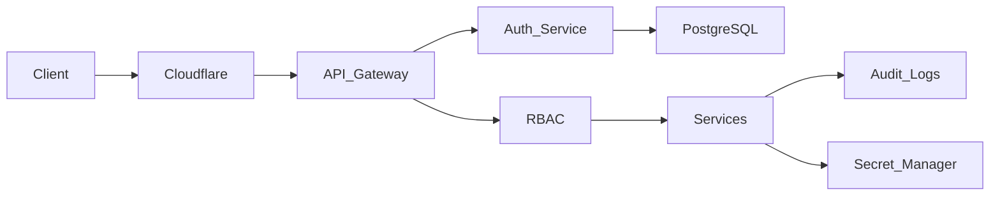

# 08 - Security

## Purpose

The Security Layer protects the R Agent Cloud platform, its users, deployed AI agents, and all associated resources. It provides authentication, authorization, secure communication, secret management, audit logging, and infrastructure security.

The security architecture follows the principle of **Zero Trust**, where every request is authenticated, authorized, and validated before accessing platform resources.

---

# Security Goals

- Secure user authentication
- Fine-grained authorization
- Secure API access
- Protect deployed AI agents
- Secure communication between services
- Secure secret management
- Prevent abuse through rate limiting
- Maintain audit trails
- Ensure compliance with security best practices

---

# Security Architecture

---

# Authentication

R Agent Cloud supports multiple authentication methods.

## Email & Password

Users can authenticate using their email address and password.

Passwords are:

- Never stored in plain text
- Hashed using bcrypt
- Salted before storage

---

## OAuth 2.0

Supported providers:

- GitHub
- Google (Future)
- Microsoft (Future)

OAuth is primarily used for:

- User Login
- GitHub Repository Integration

---

## JWT Authentication

After successful authentication, the platform issues:

- Access Token
- Refresh Token

Access Token

- Short-lived
- Used for API requests

Refresh Token

- Long-lived
- Used to obtain a new access token

---

# Authorization (RBAC)

The platform uses **Role-Based Access Control (RBAC)**.

## Roles

| Role | Permissions |
|-------|-------------|
| Owner | Full access |
| Admin | Manage organization and projects |
| Developer | Deploy and manage agents |
| Viewer | Read-only access |

---

# Resource Permissions

Resources include:

- Projects
- Agents
- Deployments
- Runtime Instances
- API Keys
- Dashboards
- Logs
- Metrics

Every request checks whether the authenticated user has permission to access the requested resource.

---

# API Security

Every REST API request passes through:

1. Authentication
2. JWT Validation
3. Authorization
4. Input Validation
5. Rate Limiting
6. Audit Logging

---

# API Keys

Projects can generate API Keys for programmatic access.

Each API Key contains:

- Unique Identifier
- Hashed Secret
- Owner
- Expiration Date
- Scope

Example scopes:

- deployments:read
- deployments:write
- runtime:execute
- metrics:read

---

# Secret Management

Sensitive values are never stored inside source code.

Secrets include:

- OpenAI API Keys
- Anthropic API Keys
- GitHub Tokens
- Oracle Database Credentials
- PostgreSQL Credentials
- Redis Credentials
- JWT Secret
- OAuth Credentials

Secrets are loaded through environment variables or a dedicated secret manager.

---

# Secure Communication

## External Communication

All external communication uses HTTPS with TLS.

Examples:

- Dashboard
- REST APIs
- GitHub Webhooks

---

## Internal Communication

Microservices communicate through:

- gRPC over TLS

This encrypts all service-to-service traffic.

---

# GitHub Webhook Security

Incoming GitHub webhooks are verified before processing.

Validation includes:

- Signature Verification
- Event Type Validation
- Repository Validation
- Timestamp Validation

Invalid requests are immediately rejected.

---

# Input Validation

Every API request validates:

- JSON Schema
- YAML Schema
- Request Size
- Required Fields
- Supported Values

Invalid input returns a validation error before reaching the business logic.

---

# Rate Limiting

Rate limiting protects the platform from abuse.

Redis is used to track request counts.

Example policy:

| Endpoint | Limit |
|----------|-------|
| Authentication | 10 requests/minute |
| Deployment | 20 requests/minute |
| Runtime Execution | 100 requests/minute |
| Public APIs | Configurable |

---

# Agent Isolation

Each deployed agent executes inside an isolated runtime.

Isolation ensures:

- Independent execution
- No shared runtime state
- Fault isolation
- Improved security

Future versions may isolate agents using containers.

---

# Audit Logging

Security-sensitive actions are recorded.

Examples:

- User Login
- Failed Login
- Project Creation
- Agent Deployment
- API Key Generation
- API Key Revocation
- Role Updates
- Secret Updates

Each audit log contains:

- User ID
- Timestamp
- Action
- Resource
- IP Address
- Result

---

# Data Protection

Sensitive information is encrypted or hashed.

| Data | Protection |
|------|------------|
| Passwords | bcrypt |
| API Keys | SHA-256 Hash |
| OAuth Tokens | Encryption |
| Secrets | Secret Manager |
| HTTPS Traffic | TLS |

---

# CORS Policy

Allowed origins:

- Platform Dashboard
- Trusted Applications

All other origins are rejected unless explicitly configured.

---

# Security Headers

The API Gateway adds common security headers:

- Content-Security-Policy
- Strict-Transport-Security
- X-Frame-Options
- X-Content-Type-Options
- Referrer-Policy

---

# Logging & Monitoring

Security events are monitored through the Observability Service.

Examples:

- Authentication failures
- Unauthorized requests
- Rate limit violations
- Invalid webhooks
- Runtime failures

These events are exported through OpenTelemetry.

---

# Future Enhancements

- Multi-Factor Authentication (MFA)
- Single Sign-On (SSO)
- Hardware Security Module (HSM)
- WebAuthn / Passkeys
- Fine-Grained Permissions (ABAC)
- Secrets Rotation
- IP Allow Lists
- Security Compliance Reports
- Threat Detection

---

# Security Best Practices

- Principle of Least Privilege
- Zero Trust Architecture
- Encryption in Transit
- Encryption at Rest
- Secure Secret Storage
- Continuous Audit Logging
- Input Validation
- Dependency Scanning
- Regular Security Reviews

---

# Summary

The Security Layer ensures that R Agent Cloud is secure by design. It combines JWT authentication, OAuth integration, RBAC authorization, encrypted communication, secure secret management, API protection, audit logging, and runtime isolation to protect users, AI agents, and platform infrastructure while maintaining a scalable cloud-native architecture.