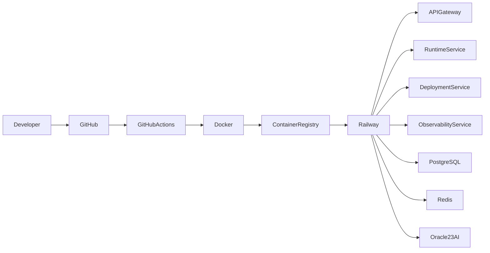

# 09 - DevOps & Infrastructure

## Purpose

The DevOps & Infrastructure layer is responsible for building, deploying, scaling, monitoring, and maintaining the R Agent Cloud platform. It provides a cloud-native deployment pipeline that automates application delivery while ensuring reliability, scalability, and high availability.

This layer enables continuous integration, continuous deployment (CI/CD), containerization, infrastructure automation, and production monitoring.

---

# Goals

- Automated Deployment
- Continuous Integration
- Continuous Delivery
- Infrastructure as Code
- High Availability
- Zero-Downtime Deployments
- Scalability
- Production Monitoring
- Disaster Recovery

---

# Infrastructure Overview



---

# Development Environment

## Local Development

Developers use Docker Compose to start all required services locally.

Services include:

- API Gateway
- Deployment Service
- Runtime Service
- Observability Service
- PostgreSQL
- Redis
- OpenTelemetry Collector
- Prometheus
- Grafana

---

# Containerization

Every microservice is packaged into an independent Docker image.

Example services:

- api-gateway
- deployment-service
- runtime-service
- observability-service
- frontend

Each service follows the same deployment process.

---

# Docker Structure

```text
services/

├── api-gateway/
│   └── Dockerfile
│
├── deployment-service/
│   └── Dockerfile
│
├── runtime-service/
│   └── Dockerfile
│
├── observability-service/
│   └── Dockerfile
│
└── frontend/
    └── Dockerfile
```

---

# Docker Compose

Docker Compose is used for local development.

It starts:

- PostgreSQL
- Redis
- Oracle Database 23ai (Development Instance)
- OpenTelemetry Collector
- Prometheus
- Grafana
- All Backend Services
- Frontend

This provides a complete local environment for testing.

---

# CI/CD Pipeline

GitHub Actions automates the deployment process.

Pipeline stages:

1. Checkout Source Code
2. Install Dependencies
3. Run Unit Tests
4. Run Linting
5. Build Docker Images
6. Push Images to Container Registry
7. Deploy Services
8. Verify Deployment
9. Notify Team

---

# Deployment Strategy

For the MVP, services are deployed on Railway.

Responsibilities of Railway:

- Container Hosting
- Automatic HTTPS
- Environment Variables
- Service Networking
- Automatic Restarts
- Horizontal Scaling

Future versions may migrate to Kubernetes.

---

# Environment Management

Each environment has independent configuration.

Supported environments:

- Development
- Testing
- Staging
- Production

Configuration is managed through environment variables.

---

# Configuration Management

Application configuration includes:

- Database URLs
- Redis URL
- Oracle Database URL
- JWT Secret
- GitHub OAuth
- OpenAI API Keys
- Anthropic API Keys
- OpenTelemetry Endpoint

Sensitive values are never committed to source control.

---

# Infrastructure Components

| Component | Technology |
|-----------|------------|
| Source Control | GitHub |
| CI/CD | GitHub Actions |
| Containerization | Docker |
| Local Development | Docker Compose |
| Cloud Platform | Railway |
| Edge Layer | Cloudflare Workers |
| Monitoring | Grafana |
| Metrics | Prometheus |
| Tracing | OpenTelemetry |
| Logging | OpenTelemetry Collector |

---

# Scaling Strategy

The platform is designed using stateless microservices.

Each service can scale independently.

Examples:

- API Gateway
- Runtime Service
- Deployment Service
- Observability Service

Future versions will support automatic horizontal scaling.

---

# Health Checks

Every service exposes a health endpoint.

Example:

```http
GET /health
```

Health information includes:

- Service Status
- Database Connectivity
- Redis Connectivity
- External API Status
- Runtime Health

---

# Logging Strategy

Every service produces structured logs.

Logs include:

- Timestamp
- Service Name
- Request ID
- Trace ID
- Log Level
- Message

Logs are exported to the Observability platform.

---

# Monitoring

Infrastructure metrics include:

- CPU Usage
- Memory Usage
- Disk Usage
- Network Traffic
- Request Rate
- Error Rate
- Response Time

These metrics are visualized through Grafana dashboards.

---

# Backup & Recovery

The platform supports scheduled backups.

Backup targets:

- PostgreSQL
- Oracle Database 23ai
- Configuration Files

Recovery objectives:

- Database restoration
- Configuration restoration
- Deployment rollback

---

# Disaster Recovery

Recovery strategy includes:

- Automated backups
- Deployment rollback
- Service restart
- Database recovery
- Infrastructure recreation

---

# Production Readiness Checklist

- Dockerized Services
- CI/CD Pipeline
- HTTPS Enabled
- Environment Isolation
- Monitoring Enabled
- Centralized Logging
- Database Backups
- Health Checks
- Secure Secrets Management
- Rate Limiting
- API Versioning

---

# Future Roadmap

Future infrastructure improvements include:

- Kubernetes Deployment
- Helm Charts
- Infrastructure as Code (Terraform)
- Multi-Region Deployment
- Auto Scaling
- Blue-Green Deployments
- Canary Releases
- Service Mesh (Istio)
- Multi-Cloud Support
- GitOps with ArgoCD

---

# Summary

The DevOps & Infrastructure layer provides the operational foundation for R Agent Cloud. Using Docker, Docker Compose, GitHub Actions, Railway, Cloudflare Workers, OpenTelemetry, Prometheus, and Grafana, it enables automated deployments, reliable service management, monitoring, scalability, and production-ready cloud infrastructure while keeping the MVP simple enough to develop and maintain.