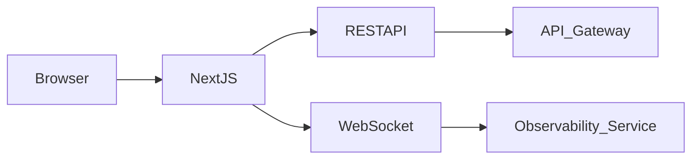
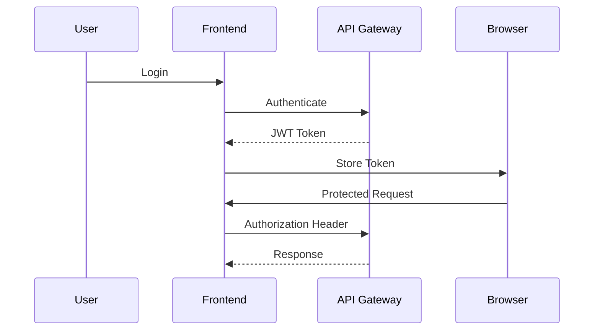

# 10 - Frontend

## Purpose

The Frontend serves as the primary interface between developers and the R Agent Cloud platform. It enables users to create projects, deploy AI agents, monitor deployments, inspect traces, manage infrastructure, and analyze runtime performance through a unified dashboard.

The frontend focuses on providing a modern, responsive, and real-time experience while communicating with backend services through REST APIs and WebSockets.

---

# Goals

- Simple User Experience
- Real-Time Monitoring
- Agent Deployment
- Deployment Management
- AI Agent Visualization
- Runtime Analytics
- Cost Monitoring
- Project Management
- Responsive Dashboard

---

# Technology Stack

| Layer | Technology |
|--------|------------|
| Framework | Next.js |
| Language | TypeScript |
| UI Library | React |
| Styling | Tailwind CSS |
| Components | shadcn/ui |
| State Management | Zustand |
| Data Fetching | TanStack Query |
| Forms | React Hook Form |
| Charts | Recharts |
| Graph Visualization | React Flow |
| Icons | Lucide React |
| Real-Time | WebSockets |
| Authentication | JWT + OAuth |

---

# Frontend Architecture



---

# Application Structure

```text
frontend/
│
├── app/
│
├── components/
│
├── features/
│
├── hooks/
│
├── services/
│
├── store/
│
├── lib/
│
├── types/
│
├── styles/
│
└── public/
```

---

# Pages

## Authentication

- Login
- Register
- Forgot Password
- OAuth Login

---

## Dashboard

Displays overall platform statistics.

Features:

- Active Projects
- Active Agents
- Deployments
- Runtime Health
- Cost Summary
- Recent Activities

---

## Projects

Users can:

- Create Project
- Delete Project
- Connect GitHub Repository
- View Project Details

---

## Agent Management

Users can:

- Create Agent
- Update Agent
- Delete Agent
- Configure Runtime
- View Agent Details

---

## Deployment Dashboard

Displays:

- Deployment Status
- Deployment History
- Runtime Version
- Rollback
- Deployment Logs

---

## Runtime Dashboard

Displays:

- Runtime Status
- CPU Usage
- Memory Usage
- Active Requests
- Runtime Logs

---

## Observability Dashboard

Displays:

- Metrics
- Traces
- Logs
- Token Usage
- API Cost
- Error Rate
- Response Time

---

## Trace Explorer

Allows developers to inspect complete execution traces.

Displays:

- Trace Timeline
- Span Details
- Tool Calls
- LLM Requests
- Execution Duration

---

## AI Agent Visualization

Displays communication between multiple AI agents.

Example:

```text
Planner

↓

Research

↓

Tool

↓

Reviewer

↓

Response
```

Built using **React Flow**.

---

## Knowledge Base

Allows users to:

- Upload Documents
- Manage Knowledge Base
- View Embeddings
- Manage RAG Sources

---

## Settings

Manage:

- Profile
- API Keys
- Organizations
- Team Members
- Billing
- Integrations

---

# Navigation

```text
Dashboard

Projects

Agents

Deployments

Runtime

Observability

Knowledge Base

Settings
```

---

# Components

## Layout

- Sidebar
- Header
- Footer
- Navigation
- Breadcrumb

---

## Dashboard Widgets

- Statistics Cards
- Deployment Table
- Runtime Status
- Cost Cards
- Health Indicators

---

## Forms

- Create Project
- Create Agent
- Deployment Configuration
- YAML Editor
- API Key Generation

---

## Data Tables

- Projects
- Agents
- Deployments
- Runtime Instances
- Logs
- Audit Logs

---

## Charts

Dashboard visualizations include:

- Request Rate
- CPU Usage
- Memory Usage
- Token Usage
- Deployment Trends
- Cost Analysis
- Error Rate
- Response Time

---

# State Management

The frontend stores:

- User Session
- Authentication State
- Selected Project
- Selected Agent
- Dashboard Filters
- Theme
- Notifications

Global state is managed using Zustand.

Server state is managed using TanStack Query.

---

# API Integration

REST APIs are used for:

- Authentication
- Projects
- Deployments
- Runtime
- Agent Management
- Knowledge Base
- API Keys

---

# WebSocket Integration

Real-time updates include:

- Deployment Started
- Deployment Completed
- Runtime Status
- Live Logs
- Trace Updates
- Metrics
- Notifications

This eliminates the need for constant polling.

---

# Authentication Flow



---

# Responsive Design

Supported devices:

- Desktop
- Laptop
- Tablet
- Mobile

The dashboard is optimized for large screens while remaining fully functional on smaller devices.

---

# User Experience Features

- Dark Mode
- Light Mode
- Search
- Filters
- Pagination
- Toast Notifications
- Loading Skeletons
- Error Boundaries
- Empty States

---

# Performance Optimization

- Code Splitting
- Lazy Loading
- Image Optimization
- Route Prefetching
- API Response Caching
- Virtualized Tables
- Memoization

---

# Accessibility

The frontend follows accessibility best practices:

- Keyboard Navigation
- ARIA Labels
- Screen Reader Support
- Color Contrast
- Focus Management

---

# Future Enhancements

- Drag-and-Drop Workflow Builder
- Visual YAML Editor
- AI Deployment Assistant
- Multi-Tenant Dashboard
- Live Collaboration
- Plugin Marketplace
- Mobile Application
- Custom Dashboard Builder
- Theme Customization

---

# Summary

The Frontend provides a modern, real-time dashboard for managing every aspect of R Agent Cloud. Built with Next.js, React, TypeScript, Tailwind CSS, and shadcn/ui, it enables developers to deploy AI agents, monitor runtime performance, inspect distributed traces, manage knowledge bases, visualize multi-agent workflows, and administer projects from a single, responsive interface.